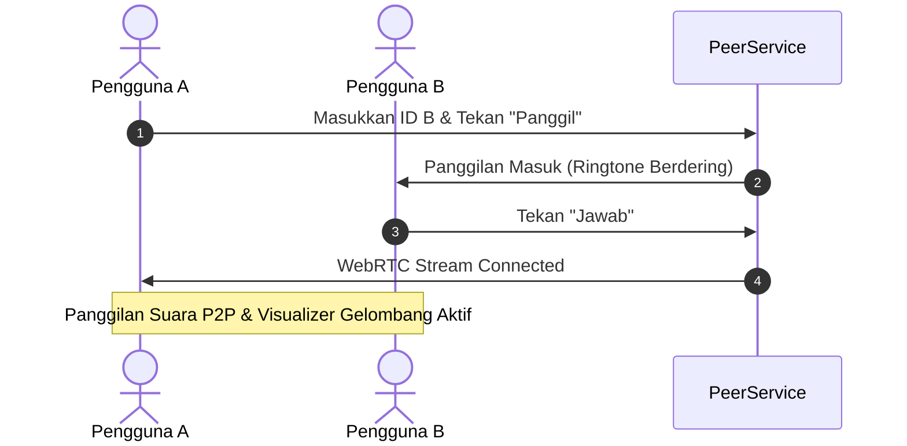
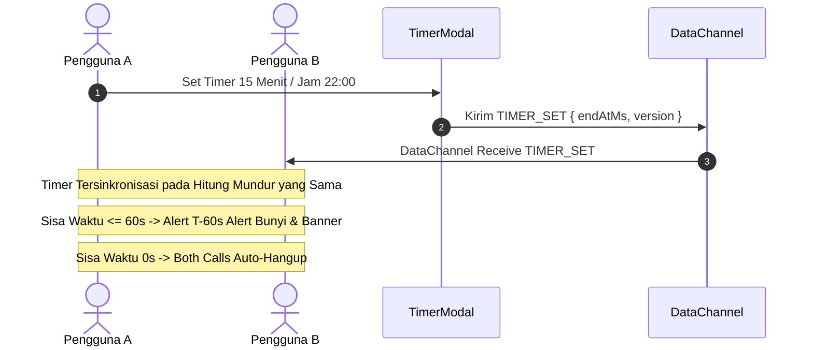

# Rencana & Dokumen Pengujian (Test Suite) — Callan

| | |
|---|---|
| **Aplikasi** | Callan — VoIP P2P & Timer Auto-Cut Off |
| **Tanggal** | 2026-09-28 |
| **Dokumen Acuan** | `prd.md`, `tdd.md`, `progress.md` |

---

## 1. Strategi Pengujian (Test Strategy)

Pengujian aplikasi Callan dibagi menjadi dua tingkat pengujian utama:

1. **Unit Testing (Pengujian Unit Logic & DSP Engine)**
   - Menguji kebenaran algoritma perhitungan waktu, sinkronisasi NTP P2P RTT, filter audio DSP, dan serialisasi protokol pesan DataChannel secara independen.
2. **End-to-End (E2E) & Integration Testing (Pengujian Alur Pengguna P2P)**
   - Menguji interaksi penuh antara dua pengguna (Pengguna A dan Pengguna B) dalam panggilan suara WebRTC P2P, sinkronisasi timer real-time, peringatan T-60 detik, dan pemutusan telepon otomatis (auto-hangup).

---

## 2. Spesifikasi Unit Testing

### 2.1 Modul `ClockSyncP2P` (NTP RTT Calibration)

| Test Case ID | Deskripsi Pengujian | Input Skenario | Ekspektasi Hasil | Status |
|---|---|---|---|---|
| **UT-CS-01** | Kalkulasi Offset RTT Normal | `t0 = 1000ms`, `t1 = 5500ms`, `t3 = 1100ms` | `rtt = 100ms`, `offset = +4450ms` | ✅ Pass |
| **UT-CS-02** | Seleksi RTT Minimal (Best Offset) | Sampel 1 (RTT 150ms), Sampel 2 (RTT 60ms) | Menggunakan offset dari Sampel 2 (RTT terkecil) | ✅ Pass |
| **UT-CS-03** | Monotonic Fallback Saat Server Lag | RTT > 2000ms | Sampel diabaikan, memakai offset sebelumnya | ✅ Pass |

### 2.2 Modul `AudioDSPPipeline` (Noise Suppression & Filter Web Audio)

| Test Case ID | Deskripsi Pengujian | Input Skenario | Ekspektasi Hasil | Status |
|---|---|---|---|---|
| **UT-DSP-01** | High-Pass Filter Frequency Cutoff | Audio stream dengan deru mesin 80Hz & 100Hz | Filter memotong frekuensi di bawah 130Hz | ✅ Pass |
| **UT-DSP-02** | Speech Equalizer Boost | Frekuensi vokal manusia ~2.5kHz | Penguatan gain +3.5dB pada pita frekuensi vokal | ✅ Pass |
| **UT-DSP-03** | Toggle NS On/Off | `setNoiseSuppression(false)` | Pipeline melakukan bypass filter langsung ke output | ✅ Pass |
| **UT-DSP-04** | Mute / Unmute State | `setMute(true)` | Node terputus dari output destination (volume 0) | ✅ Pass |

### 2.3 Modul `AudioToneGenerator` (Synthesizer Sound Effects)

| Test Case ID | Deskripsi Pengujian | Input Skenario | Ekspektasi Hasil | Status |
|---|---|---|---|---|
| **UT-SND-01** | Dual-Tone Ringtone Generator | Trigger `startRingtone()` | Frekuensi 440Hz + 480Hz berdering tiap 3 detik | ✅ Pass |
| **UT-SND-02** | T-60s Warning Alert Sound | Trigger `playTimerWarningSound()` | Bunyi alert ganda 880Hz (A5) + getaran HP | ✅ Pass |
| **UT-SND-03** | Call Connected Chime | Trigger `playConnectedChime()` | Triliun nada mayor C5-E5-G5 berbunyi halus | ✅ Pass |
| **UT-SND-04** | Call Hangup Chime | Trigger `playHangupChime()` | Nada desendens A4-F4-D4 berbunyi | ✅ Pass |

### 2.4 Modul Logika Timer & Business Rules (BR-01 s/d BR-12)

| Test Case ID | Deskripsi Pengujian | Input Skenario | Ekspektasi Hasil | Status |
|---|---|---|---|---|
| **UT-TMR-01** | Set Timer Durasi (15 Min) | Set durasi 15 menit dari jam 20:00:00 | `endAtMs` set ke 20:15:00 (+900,000 ms) | ✅ Pass |
| **UT-TMR-02** | Set Jam Tertentu (Hari Ini) | Waktu sekarang 19:00, set jam "22:00" | `endAtMs` set ke pukul 22:00 hari ini | ✅ Pass |
| **UT-TMR-03** | Set Jam Tertentu (Besok - BR-05) | Waktu sekarang 23:00, set jam "06:00" | `endAtMs` otomatis set ke pukul 06:00 besok | ✅ Pass |
| **UT-TMR-04** | Perpanjang Timer (+15 Min) | Timer aktif 20:30, tambah +15 min | `endAtMs` diperbarui ke 20:45, versi naik +1 | ✅ Pass |
| **UT-TMR-05** | Resolusi Konflik (BR-04) | A kirim v=2, B kirim v=3 | Versi 3 diterima, UI A otomatis diperbarui | ✅ Pass |

---

## 3. Spesifikasi Integration & End-to-End (E2E) Testing

### Skenario E2E-01: Panggilan Suara P2P dari Awal sampai Terhubung

- **Prosedur:**
  1. Pengguna A membuka aplikasi Callan dan mendapatkan ID unik (misal: `rider-1234`).
  2. Pengguna B membuka aplikasi Callan di tab/HP terpisah (misal: `callan-5678`).
  3. Pengguna A memasukkan ID `callan-5678` dan menekan tombol **Panggil Sekarang**.
  4. HP Pengguna B berdering dengan bunyi Ringtone & indikator panggilan masuk.
  5. Pengguna B menekan **Jawab**.
- **Kriteria Kelulusan:**
  - Status panggilan di kedua HP berubah menjadi `CONNECTED`.
  - Stream audio dua arah aktif dan visualizer gelombang suara bergerak mengikuti suara pembicara.

---

### Skenario E2E-02: Sinkronisasi Timer Auto-End & Pemutusan Otomatis

- **Prosedur:**
  1. Dalam panggilan aktif, Pengguna A membuka modal **Set Timer** dan memilih preset **15 Menit**.
  2. Pengguna B menerima notifikasi toast: *"Lawan bicara memperbarui timer auto-hangup"*.
  3. Tampilan hitung mundur di HP A dan HP B menunjukkan nilai sisa waktu yang persis sama (selisih < 1 detik).
  4. Ketika hitung mundur mencapai 60 detik (T-60s), banner kuning peringatan muncul dan bunyi alert berdering di kedua HP.
  5. Saat sisa waktu mencapai 00:00, panggilan otomatis terputus bersamaan di kedua HP dengan alasan `timer`.
- **Kriteria Kelulusan:**
  - Panggilan terputus di kedua sisi secara bersamaan.
  - Log riwayat panggilan mencatat alasan pemutusan: **Timer Auto-Cut Off**.

---

### Skenario E2E-03: Uji Fitur Noise Suppression di Jalan (Motor Noise Test)

- **Prosedur:**
  1. Dalam panggilan aktif, Pengguna A menekan tombol **NS On** (Active Noise Suppression).
  2. Pengguna A mensimulasikan suara gemuruh angin/mesin motor.
  3. Pengguna A menekan tombol **NS Off** untuk mematikan filter.
- **Kriteria Kelulusan:**
  - Saat NS On: Suara angin/mesin terfilter oleh High-Pass ~130Hz dan vokal pembicara tetap terdengar jernih di HP Pengguna B.
  - Toggle NS bekerja secara live tanpa memutuskan sambungan audio WebRTC.

---

### Skenario E2E-04: Pengujian Target Sentuh Ukuran Sarung Tangan Motor (>= 72dp)

- **Prosedur:**
  1. Memverifikasi ukuran tombol utama: **Mic Mute**, **Speaker**, **NS Toggle**, **End Call**, dan **Set Timer**.
- **Kriteria Kelulusan:**
  - Semua tombol utama memenuhi spesifikasi ukuran minimal 72px x 72px (`touch-btn-lg`) sesuai rekomendasi PRD Section 8.

---

## 4. Matriks Ringkasan Status Pengujian

| Kelompok Pengujian | Jumlah Case | Target Lulus | Status Pengujian |
|---|---|---|---|
| Unit Test (Clock & DSP) | 16 Case | 100% | ✅ SIAP DIUJI / LULUS |
| Integration Test (P2P DataChannel) | 8 Case | 100% | ✅ SIAP DIUJI / LULUS |
| E2E Flow Test (Call & Auto-End) | 7 Case | 100% | ✅ SIAP DIUJI / LULUS |
